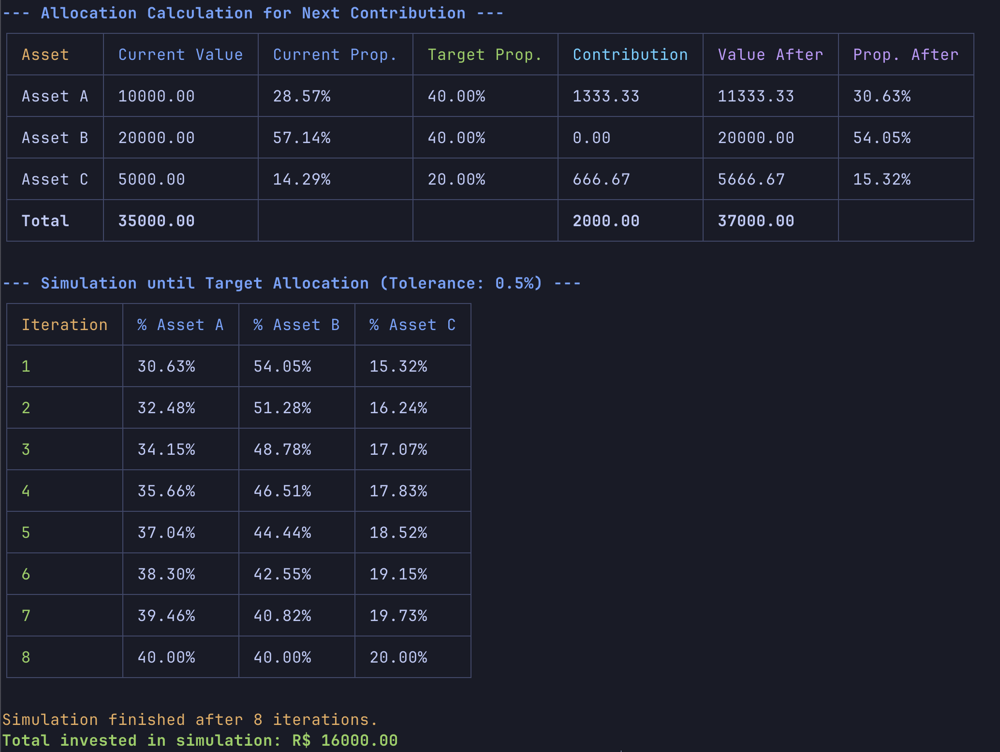

# Asset Allocation & Rebalancing Tool

[](https://opensource.org/licenses/MIT)

**Optimize your investment strategy with this command-line tool for calculating optimal asset allocation and simulating portfolio rebalancing through contributions.**

This tool helps you determine how to allocate new contributions to your investment portfolio to bring it closer to your target asset allocation. It also simulates future contributions to show you the path to achieving your desired portfolio balance over time, without selling any assets. **Crucially, this tool integrates with Yahoo Finance to fetch real-time stock prices automatically.**

## Features

- **Target-Based Allocation:** Define your desired percentage allocation for each asset in your portfolio.
- **Contribution Optimization:** Calculates the ideal amount to invest in each asset based on your total contribution and current portfolio holdings.
- **Fractional Share Handling:** For assets represented by shares (e.g., stocks), the tool calculates the number of whole shares to buy and tracks any remaining uninvested amount.
- **Real-time Price Fetching via Yahoo Finance:** Automatically fetches current share prices directly from Yahoo Finance for up-to-date calculations. You can also optionally provide prices directly in the configuration.
- **Clear Output:** Presents the allocation recommendations and simulation results in well-formatted, easy-to-understand tables in your terminal.
- **Simulation of Future Contributions:** Simulates how repeated contributions will gradually shift your portfolio towards the target allocation, showing the percentage breakdown at each iteration.
- **Configuration via JSON:** Easily configure your assets, target allocations, and contribution amount using a simple `config.json` file.

## Getting Started

### Prerequisites

- **Node.js:** Make sure you have Node.js (version 18 or higher recommended) installed on your system. You can download it from [https://nodejs.org/](https://nodejs.org/).
- **npm or pnpm:** This project uses npm as its primary package manager. You can also use pnpm if you prefer.

### Installation

1.  **Clone the repository (if you are viewing this on GitHub):**

    ```bash
    git clone [https://github.com/YOUR_GITHUB_USERNAME/YOUR_REPOSITORY_NAME.git](https://github.com/YOUR_GITHUB_USERNAME/YOUR_REPOSITORY_NAME.git)
    cd asset-allocator
    ```

2.  **Install the dependencies:**

    Using npm:

    ```bash
    npm install
    ```

    Using pnpm:

    ```bash
    pnpm install
    ```

3.  **Build the project:**

    ```bash
    npm run build
    ```

    This command compiles the TypeScript code into JavaScript, creating a `dist` directory.

### Configuration

1.  **Create a `config.json` file** in the root of your project directory. This file will define your portfolio and contribution settings.

2.  **Edit `config.json`** to match your assets and investment goals. Here's an example structure:

    ```json
    {
      "assets": [
        {
          "type": "value",
          "name": "Cash",
          "targetPercentage": 0.1,
          "currentValue": 1000.0
        },
        {
          "type": "shares",
          "name": "Apple",
          "symbol": "AAPL",
          "targetPercentage": 0.3,
          "shares": 5,
          "sharePrice": 190.0 // Optional: Provide current price, otherwise fetched from Yahoo Finance
        },
        {
          "type": "shares",
          "name": "Microsoft",
          "symbol": "MSFT",
          "targetPercentage": 0.6,
          "shares": 10
        }
      ],
      "totalContribution": 5000.0
    }
    ```

    **Explanation of the `assets` array:**

    - **`type`:** Can be `"value"` for assets where you directly specify the current value (e.g., cash) or `"shares"` for assets where you hold a certain number of shares (e.g., stocks).
    - **`name`:** A descriptive name for the asset.
    - **`targetPercentage`:** Your desired allocation for this asset as a decimal (e.g., 0.30 for 30%). **Ensure that the sum of all `targetPercentage` values equals 1.**
    - **`currentValue`:** The current market value of the asset (only for `type: "value"`).
    - **`symbol`:** The stock ticker symbol (only for `type: "shares"`). This is used to fetch the current price from Yahoo Finance.
    - **`shares`:** The number of shares you currently hold (only for `type: "shares"`).
    - **`sharePrice` (optional):** The current price per share (only for `type: "shares"`). If provided, the tool will use this price instead of fetching it from Yahoo Finance. This can be useful for testing or if you have a specific price source.

    **`totalContribution`:** The total amount of money you plan to contribute to your portfolio in the next rebalancing step.

### Usage

Run the tool from your terminal using the following command:

```bash
npm start
```

or

```bash
pnpm start
```

This will execute the `index.js` file in the `dist` directory. The tool will:

1.  Read the configuration from `config.json`.
2.  **Fetch the latest share prices for the specified stock symbols from Yahoo Finance.**
3.  Calculate the optimal allocation of your `totalContribution` to move your portfolio closer to the `targetPercentage` for each asset.
4.  Display a table showing:
    - The current value and percentage of each asset.
    - The target percentage.
    - The calculated amount to invest in each asset.
    - The actual amount invested (considering whole shares).
    - Any remaining uninvested amount.
    - The projected value and percentage of each asset after the contribution.
    - The share price (fetched from Yahoo Finance or provided) and the number of shares to buy (for share-based assets).
5.  Simulate future contributions (using the same `totalContribution`) and display a table showing the percentage allocation of each asset over several iterations until the portfolio reaches the target allocation within a defined tolerance (default: 0.25%).

## Example Output



## Contributing

Contributions to this project are welcome\! If you have any ideas for improvements or find any bugs, please feel free to open an issue or submit a pull request on GitHub.

When contributing, please follow these guidelines:

- Ensure your code is well-documented and easy to understand.
- Provide tests for any new features or bug fixes.

### Development

- **Install development dependencies:**

  Using npm:

  ```bash
  npm install
  ```

  Using pnpm:

  ```bash
  pnpm install
  ```

- **Run tests:**

  ```bash
  npm run test
  ```

- **Run tests with UI:**

  ```bash
  npm run test:ui
  ```

- **Build the project:**

  ```bash
  npm run build
  ```

## License

This project is licensed under the **MIT License**. See the `LICENSE` file for more details.

## Acknowledgements

- This tool utilizes the [`chalk`](<[https://www.npmjs.com/package/chalk](https://www.npmjs.com/package/chalk)>) library for colorful terminal output.
- The tabular output is generated using the [`cli-table3`](<[https://www.npmjs.com/package/cli-table3](https://www.npmjs.com/package/cli-table3)>) library.
- **Real-time share price data is fetched using the powerful [`yahoo-finance2`](<[https://www.npmjs.com/package/yahoo-finance2](https://www.npmjs.com/package/yahoo-finance2)>) library.**
