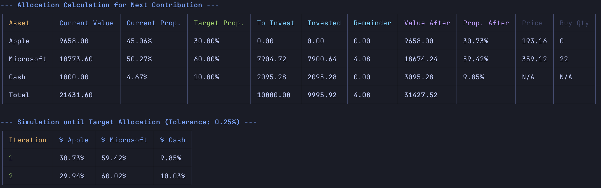

# Asset Allocation CLI

A command-line tool to calculate optimal asset allocation contributions and simulate portfolio evolution.


## Key Features

- **Optimal Contribution Calculation:** Aligns portfolio with target percentages, without selling.
- **Detailed Allocation Table:** Displays portfolio state, target allocation, contributions, and post-contribution result.
- **Future Allocation Simulation:** Simulates contributions up to 0.25% tolerance, showing percentage evolution.
- **JSON Configuration:** Use `config.json` for assets, holdings, targets, and contributions (supports \"shares\" and \"value\").

## Screenshot



## Installation

1.  **Clone the repository:**

    ```bash
    git clone <repository_url>
    cd <repository_name>
    ```

2.  **Install dependencies:**

    ```bash
    pnpm install
    ```

3.  **Configure the portfolio:**

    - Copy `config.example.json` to `config.json`.
    - Edit `config.json` with your portfolio data.

    `config.json` structure:

    ```json
    {
      "$schema": "./config.schema.json",
      "totalContribution": 10000,
      "assets": [
        {
          "type": "shares",
          "name": "STOCK_A",
          "symbol": "STKA.SA",
          "shares": 100,
          "targetPercentage": 0.4
        },
        {
          "type": "value",
          "name": "FUND_B",
          "currentValue": 5000,
          "targetPercentage": 0.3
        },
        {
          "type": "shares",
          "name": "STOCK_C",
          "symbol": "STKC.SA",
          "shares": 50,
          "targetPercentage": 0.2
        },
        {
          "type": "value",
          "name": "CASH",
          "currentValue": 2000,
          "targetPercentage": 0.1
        }
      ]
    }
    ```

    - `totalContribution`: Contribution amount.
    - `assets`: Array of assets:
      - `type`: \"shares\" or \"value\".
      - `name`: Asset name.
      - \"shares\" properties: `symbol`, `shares` (>= 0).
      - \"value\" properties: `currentValue` (>= 0).
      - `targetPercentage`: Target percentage (0 to 1).
    - Simulation uses 0.25% tolerance.

## Usage

1.  **Run the application:**

    ```bash
    pnpm start
    ```

    The application reads `config.json`, displays the contribution table, and simulates contributions until 0.25% tolerance is reached.

## Tests

To run tests:

```bash
pnpm test
```
